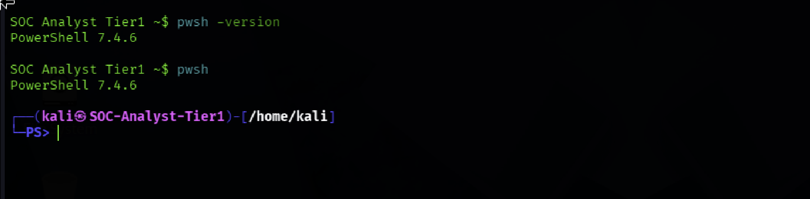
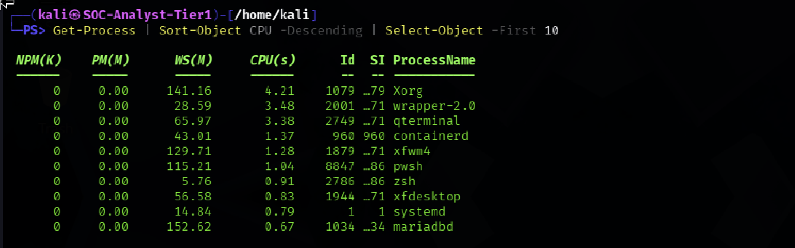
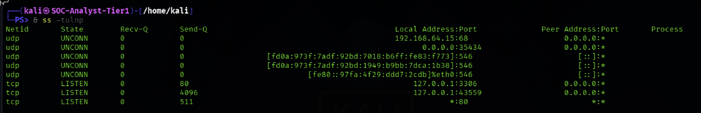
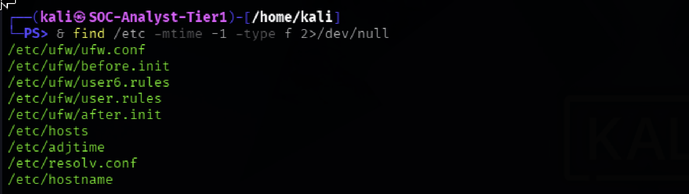
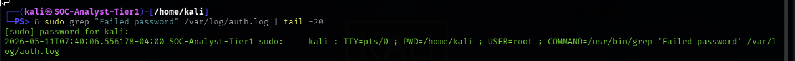
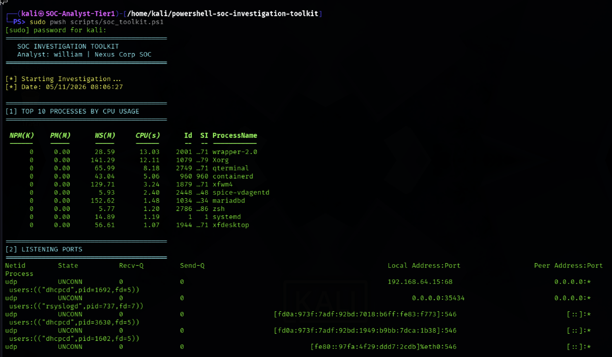
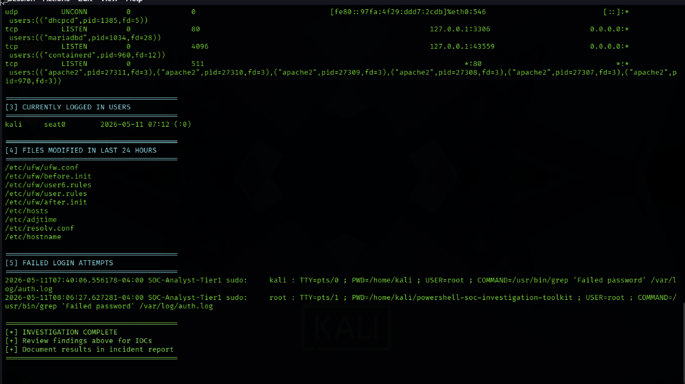

# SOC Tier 1 Incident Report: PowerShell SOC Investigation Toolkit

---

## Incident Summary

- **Incident Type:** SOC Automation Endpoint Investigation Toolkit Development
- **Severity:** Medium (Operational Capability Build)
- **Detection Method:** Automated Multi-Module Endpoint Triage via PowerShell
- **Tools Used:** PowerShell 7.4.6 (Cross-Platform), `Get-Process`, `ss`, `who`, `find`, `grep`
- **Status:** Complete Toolkit Operational, 6 Modules Active

---

## Executive Summary

A cross-platform PowerShell SOC investigation toolkit was built and deployed on a Kali Linux VM. The toolkit automates six core investigation steps a Tier 1 / Tier 2 analyst performs during endpoint triage: process analysis, port enumeration, user session detection, file integrity checking, and failed-login hunting.

The output is structured, color coded, and designed for rapid triage during a live incident. All six modules executed successfully, with findings documented across processes, listening ports, users, modified files, and authentication logs.

---

## Affected System

- **Target Host:** Kali Linux VM (`SOC-Analyst-Tier1`)
- **Scripting Engine:** PowerShell 7.4.6 (cross-platform `pwsh`)
- **Toolkit Path:** `scripts/soc_toolkit.ps1`
- **Investigation Surface:**
  - Process table
  - Listening ports / network sockets
  - Active user sessions
  - `/etc` file modification timestamps
  - `/var/log/auth.log` authentication events

---

## Investigation Methodology

---

### 1. PowerShell Environment Launch



- Launched PowerShell 7.4.6 (`pwsh`) on the Kali Linux host
- Verified cross platform support and module availability
- Confirmed runtime environment for toolkit execution

### SOC Observations:

- Cross-platform PowerShell extends Windows native tooling to Linux SOC workflows
- A unified scripting layer reduces context switching during multi OS investigations
- Runtime verification prevents silent module load failures mid-investigation

---

### 2. Module 1 Top Process Enumeration



- Executed `Get-Process` to enumerate the top 10 processes by CPU
- Identified `wrapper 2.0` and `containerd` as high CPU processes
- Captured PID, name, and resource consumption for triage

### SOC Observations:

- Process enumeration is the first step in compromise assessment
- High-CPU processes warrant deeper inspection could indicate cryptominers or malware
- `containerd` is expected on container enabled hosts but should be baselined

---

### 3. Module 2 Listening Port Discovery



- Executed `ss -tulnp` to enumerate listening TCP/UDP sockets
- Identified MySQL (`3306`), Apache (`80`), and `containerd` (`43559`) as active services
- Mapped each listening port to its owning process

### SOC Observations:

- Listening service enumeration surfaces attack surface immediately
- MySQL exposure on `3306` echoes the Day 12 finding service level hardening required
- Unknown listening ports are universal investigation triggers

---

### 4. Module 4 Recently Modified Files



- Executed `find /etc -mtime -1` to identify files modified within the last 24 hours
- Surfaced UFW configuration files (consistent with Day 12 hardening work)
- Confirmed no unexpected modifications

### SOC Observations:

- File modification hunting is core to persistence detection
- `/etc` changes are high signal system configuration tampering occurs here
- Modifications must be correlated with authorized change activity

---

### 5. Module 5 Authentication Log Review



- Executed `grep "Failed password"` against `/var/log/auth.log`
- Searched for brute-force and credential-stuffing indicators
- Confirmed zero failed authentication attempts in the active log window

### SOC Observations:

- Authentication log review is non-negotiable in endpoint triage
- Absence of failed logins is itself a documented investigative finding
- Failed-login hunting must be correlated across sessions and source IPs

---

### 6. Toolkit Output Consolidated View (Part 1)



- Reviewed the consolidated toolkit output across all modules
- Verified color-coded section banners for visual triage
- Confirmed structured output suitable for analyst handoff

### SOC Observations:

- Color-coded output accelerates Tier 1 triage decisions
- Structured banners support rapid scanning during active incidents
- Consolidated output reduces context-switching during investigation

---

### 7. Toolkit Output Final Section & Completion (Part 2)



- Captured the final modules and "Investigation Complete" summary banner
- Confirmed all 6 modules executed end-to-end without failure
- Validated toolkit readiness for live incident response use

### SOC Observations:

- End-to-end execution confirms toolkit operational integrity
- Completion banners support handoff and documentation workflows
- Successful runs should be retained as baseline executions for comparison

---

## Toolkit Modules

| Module | Command                    | Purpose                                          |
|--------|----------------------------|--------------------------------------------------|
| 1      | `Get-Process`              | Identify high CPU or suspicious processes        |
| 2      | `ss -tulnp`                | Discover exposed services and listening ports    |
| 3      | `who`                      | Detect unauthorized active user sessions         |
| 4      | `find /etc -mtime -1`      | Hunt for recently modified system configuration  |
| 5      | `grep "Failed password"`   | Detect brute-force authentication attempts       |
| 6      | `Write-Host` summary       | Investigation completion banner and next steps   |

---

## Investigation Findings

| Section          | Finding                                              | Risk        | Status        |
|------------------|------------------------------------------------------|-------------|---------------|
| Processes        | `wrapper-2.0` and `containerd` high CPU              | ⚠️ Noted    | Investigated  |
| Listening Ports  | MySQL `3306`, Apache `80`, containerd `43559`        | ⚠️ Noted    | Documented    |
| Active Users     | Only `kali` logged in                                | ✅ Clean    | No action     |
| Modified Files   | UFW configuration files (expected from Day 12)        | ✅ Expected | No action     |
| Failed Logins    | No failed password attempts in log window            | ✅ Clean    | No action     |

---

## Script Structure

```powershell
# ============================================
# SOC Investigation Toolkit
# Author: William | GitHub: WiLL75G
# Day 13 - PowerShell SOC Toolkit
# ============================================
# Banner
# Section 1 - Top 10 Processes by CPU
# Section 2 - Listening Ports
# Section 3 - Logged In Users
# Section 4 - Files Modified in Last 24 Hours
# Section 5 - Failed Login Attempts
# Section 6 - Investigation Complete
```

---

## How to Run

```bash
# Launch PowerShell
pwsh

# Execute the toolkit
sudo pwsh scripts/soc_toolkit.ps1
```

---

## Indicators of Compromise / Observation (IOCs)

| Type             | Indicator                                       | Source           |
|------------------|-------------------------------------------------|------------------|
| Process Activity | `wrapper-2.0`, `containerd` high CPU            | `Get-Process`    |
| Listening Service| MySQL on `3306/tcp`                             | `ss -tulnp`      |
| Listening Service| Apache on `80/tcp`                              | `ss -tulnp`      |
| Listening Service| `containerd` on `43559/tcp`                     | `ss -tulnp`      |
| Active Session   | Single user (`kali`)                            | `who`            |
| Config Changes   | UFW configuration files (expected)              | `find /etc`      |
| Auth Activity    | Zero failed password attempts                   | `auth.log` grep  |

---

## MITRE ATT&CK Mapping

| Behavior                              | Technique ID | Description                                            |
|---------------------------------------|--------------|--------------------------------------------------------|
| Process Discovery                     | T1057        | Toolkit enumerates running processes                   |
| System Network Connections Discovery  | T1049        | Listening ports enumerated for exposure assessment     |
| System Owner/User Discovery           | T1033        | Active user sessions identified                        |
| File and Directory Discovery          | T1083        | Recently modified files audited in `/etc`              |
| Account Access Removal / Brute Force  | T1110        | Failed-login telemetry reviewed for attack indicators  |
| Command and Scripting Interpreter     | T1059.001    | PowerShell used as the automation engine               |

---

## SOC Analyst Findings

- Toolkit executed all 6 modules successfully on the target host
- Process enumeration surfaced two high CPU processes flagged for baseline review
- Three listening services identified MySQL exposure consistent with Day 12 finding
- Only one active user session detected consistent with single analyst environment
- File modification audit returned only expected UFW configuration changes
- Zero failed authentication attempts observed in the active log window
- Output is structured, color-coded, and ready for analyst handoff

---

## SOC Analyst Response

- Maintain toolkit in `scripts/` directory as the standard endpoint triage entry point
- Run the toolkit at the start of every endpoint investigation for baseline visibility
- Baseline expected process and port states to support anomaly detection
- Extend the toolkit with additional modules (scheduled tasks, registry/cron analysis, SSH key audit)
- Integrate toolkit output with central logging for retention and correlation
- Use the toolkit during tabletop exercises to validate analyst workflow
- Refactor any module that returns false positives across baseline runs

---

## Analyst Insight

Automation does not replace analyst judgment it accelerates it. The strongest SOC analysts build personal toolkits that compress the first 10 minutes of every investigation into a single command. PowerShell's cross-platform support makes it an underrated choice for Linux SOC work, and the structured output model (banners, color coding, consistent formatting) is what turns raw command output into actionable triage. This toolkit is a foundation: small additions over time produce a personal investigation engine that scales with experience.

---

## Learning Outcome

This investigation demonstrates the ability to:

- Build cross-platform PowerShell scripts for SOC automation
- Combine native PowerShell cmdlets with Linux utilities (`ss`, `who`, `find`, `grep`)
- Structure investigation output for rapid Tier 1 triage
- Apply process, network, user, file, and authentication audits in a unified workflow
- Map automated checks to MITRE ATT&CK discovery techniques
- Recognize the value of personal investigation toolkits in real SOC work
- Produce reusable, extensible automation aligned with portfolio standards

---

## Repository Structure

```
powershell-soc-investigation-toolkit/
├── README.md
├── scripts/
│   └── soc_toolkit.ps1
└── screenshots/
    ├── 01_powershell_launched.png
    ├── 02_top_processes.png
    ├── 03_listening_ports.png
    ├── 04_recently_modified_files.png
    ├── 05_auth_log_check.png
    ├── 06_toolkit_output_p1.png
    └── 07_toolkit_output_p2.png
```

---

## Conclusion

This toolkit demonstrates real world SOC automation using PowerShell on a Linux platform. All six investigation modules executed successfully, producing structured, color coded output suitable for live incident response. The toolkit mirrors the exact workflow a SOC Tier 1 or Tier 2 analyst follows during endpoint triage from process analysis to log review and is designed to be reusable, extensible, and portfolio ready.
